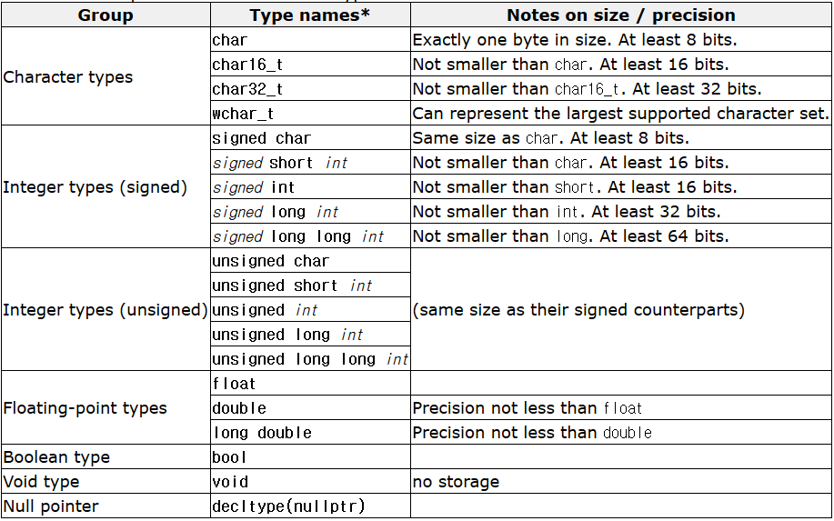
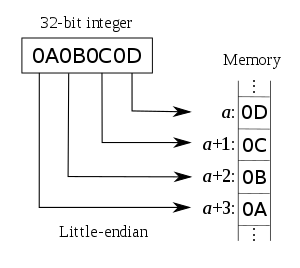
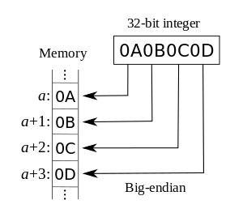

# Chapter 2

## 기본 자료형의 정의, 초기화, 그리고 대입에 대하여 (fundamental variable definition, initialization, and assignment)

### 컴퓨터의 메모리와 변수 선언 및 할당

고 수준에서 컴퓨터 메모리가 어떻게 동작하는지 정도는 아시는것이 도움이 될것입니다.

컴퓨터는 다양한 종류의 메모리를 갖고 있는데, 이 섹션에서는 RAM(Random Access Memory) 메모리에 대해 살펴보려고 합니다. 매 순간 무언가를 실앵하는 프로그램을 위한 명령과 이 프로그램이 사용하는 데이터를 저장하는 곳입니다.

여러분의 컴퓨터는 아마도 약 4GB 정도의 램을 갖고 있을것입니다. C++에서는 대부분의 메모리에 접근할 수 있으며, 이를 위해 변수를 생성합니다.  
**변수**: 정보를 저장할 수 있도록 메모리 공간을 명명한 것  
메모리는 바이트(byte)로 나뉘어지는데, 이는 C++ 어플리케이션에서 일반적으로 사용할 수 있는 최소 메모리 사이즈입니다. char, int, float..와 같은 각각 데이터 타입은 byte를 단위로 서로 다른 크기를 갖습니다. **이들은 플랫폼마다 달라질 수 있지만**, 대부분 아래와 같은 **최소 크기**를 갖습니다:  
컴파일러마다 플랫폼마다 데이터 사이즈가 달라질 수는 있습니다.

```
논리형
bool:           1 byte

문자형
char:           1 byte
wchar_t:        2 bytes
char16_t:       2 bytes -> 고정너비 16 bits
char32_t:       4 bytes -> 고정너비 32 bits

정수형
short:          2 bytes
int:            4 bytes
long:           4 bytes
long long:      8 bytes

실수형
float:          4 bytes
double:         8 bytes
long double:    8 bytes
```

```cpp
  std::cout << "bool:\t\t" << sizeof(bool) << " bytes" << std::endl;
  std::cout << "char:\t\t" << sizeof(char) << " bytes" << std::endl;
  std::cout << "wchar_t:\t" << sizeof(wchar_t) << " bytes" << std::endl;
  std::cout << "char16_t:\t" << sizeof(char16_t) << " bytes" << std::endl; // C++11,   may not be supported by your compiler
  std::cout << "char32_t:\t" << sizeof(char32_t) << " bytes" << std::endl; // C++11,   may not be supported by your compiler
  std::cout << "short:\t\t" << sizeof(short) << " bytes" << std::endl;
  std::cout << "int:\t\t" << sizeof(int) << " bytes" << std::endl;
  std::cout << "long:\t\t" << sizeof(long) << " bytes" << std::endl;
  std::cout << "long long:\t" << sizeof(long long) << " bytes" << std::endl; // C+  +11, may not be supported by your compiler
  std::cout << "float:\t\t" << sizeof(float) << " bytes" << std::endl;
  std::cout << "double:\t\t" << sizeof(double) << " bytes" << std::endl;
  std::cout << "long double:\t" << sizeof(long double) << " bytes" << std::endl;
```




배열(array)이나 문자열(string)과 같은 다른 타입들은 포함하고있는 내용에 따라 가변적인 크기를 가질 수 있습니다.

변수를 선언하는 예제는 아래와 같습니다:

```cpp
int i;
```

위의 예제에서 우리는, 4GB 중 4bytes를 정수를 저장하기 위해 예약했습니다. 여기서 정수를 저장하든, 다른 데이터형을 저장하든 상관없습니다. int냐, char냐, float냐 혹은 string이냐에 따라 메모리를 할당한 크기만 달라질 뿐입니다.

내부적으로, 컴퓨터는 메모리 영역에 대해서 `i`가 아닌, 메모리 주소로써 이해합니다. 메모리 주소는 4Gb의 메모리 내에서 특정 byte를 가리키는 숫자입니다.

`int i`와 같이 메모리를 생성하면, 프로그램에게 4bytes의 메모리를 예약하라고 말하고, 이 4bytes중 첫번째 byte의 메모리 주소를 변수명인 i와 연관시킨 뒤, `i`에 우리가 저장할 데이터의 타입인 정수만 저장되게끔 제한시킵니다. 이렇게하면 나중에 저장된 정수 하나를 표현하기 위해서 컴퓨터는 RAM의 특정 위치(주소)로 이동한 뒤,  4bytes를 읽으면 그 값이 나올 것이라는 것을 알기 때문이죠.

아래는 `int i` 선언의 메모리 할당 예시입니다.

```
                       Address (4bytes) | Value (1 byte = 8 bits)
--------------------------------------------------
0x 00000000 00000000 00000000 00000007  | 00000000
0x 00000000 00000000 00000000 00000008  | 00000000
0x 00000000 00000000 00000000 00000009  | 00000000
0x 00000000 00000000 00000000 0000000A  | 00000000
0x 00000000 00000000 00000000 0000000B  | 00000000  <-- int i 할당
0x 00000000 00000000 00000000 0000000C  | 00000000   |
0x 00000000 00000000 00000000 0000000D  | 00000000   |
0x 00000000 00000000 00000000 0000000E  | 00000000  --- int: 4 bytes
0x 00000000 00000000 00000000 0000000F  | 00000000
0x 00000000 00000000 00000000 00000010  | 00000000
0x 00000000 00000000 00000000 00000011  | 00000000
                                  ...   |   ...
```

일반적으로 메모리 주소(address)는 16진수(hexadecimal)로 표현됩니다. C++에서는 &연산자를 사용하여 메모리 주소를 얻을 수 있습니다. 아래와 같이요:

```cpp
std::cout << &i << std::endl;
```

위 `cout`의 결과가 바로 우리가 방금 선언한 변수 `i`의 첫번째 byte 메모리 주소입니다.

이후에 위 변수에 값을 대입하면, 예약된 메모리 영역에 이 값이 저장됩니다. 따라서 우리가 아래와 같이 하면:

```cpp
i = 8;
```

메모리는 내부적으로 이렇게 보여집니다:

```
                       Address (4bytes) | Value (1 byte = 8 bits)
--------------------------------------------------
0x 00000000 00000000 00000000 00000007  | 00000000
0x 00000000 00000000 00000000 00000008  | 00000000
0x 00000000 00000000 00000000 00000009  | 00000000
0x 00000000 00000000 00000000 0000000A  | 00000000
0x 00000000 00000000 00000000 0000000B  | 00000000  <-- i = 8 대입 (8 = 2^3)
0x 00000000 00000000 00000000 0000000C  | 00000000   |
0x 00000000 00000000 00000000 0000000D  | 00000000   |
0x 00000000 00000000 00000000 0000000E  | 00001000  --- int: 4 bytes
0x 00000000 00000000 00000000 0000000F  | 00000000
0x 00000000 00000000 00000000 00000010  | 00000000
0x 00000000 00000000 00000000 00000011  | 00000000
                                  ...   |   ...
```
그래서 총 4 bytes를 활용하고, (00000000 00000000 00000000 00001000) -> 8을 저장하였습니다.

그렇지만, RAM에서의 value 저장 방식과 address 참조 순서는 컴퓨터의 아키텍쳐에 따라 달라집니다. 아마도 리틀 엔디안(00001000 00000000 00000000 00000000), 빅 엔디안(00000000 00000000 00000000 00001000)에 대해 어디선가 들어본 적이 있을겁니다. 이는 데이터형의 바이트들을 메모리에 나열할 때, 큰 단위를 앞(빅 엔디안)에서 혹은 작은 단위를 앞에서(리틀 엔디안) 나열하는 것을 의미합니다. 대부분의 경우 이것에 대해서 알아야 할 필요는 없지만, 최신 현대 컴퓨터 아키텍쳐들은 리틀 엔디안을 사용합니다.




여러분이 C++ 언어를 사용해왔었다면, 아마도 잘못된 메모리 참조(bad memory access)로 인해 프로그램이 죽는 경험을 해보셨을 겁니다. 일반적으로 `segmentation fault...`라는 메시지를 뱉어냅니다. 이게 대체 무슨 의미일까요?

여러분이 프로그램에서 변수를 생성하면, 심지어 c++에서도, 보안상의 이유로 실제로 컴퓨터의 아무 메모리에 접근할 수는 없습니다. 웹브라우저에서 은행계좌를 열었다고 생각해봅시다, 만약 어떤 프로그램이든 컴퓨터의 모든 메모리에 접근이 가능하다면, 특정 악성 프로그램이 브라우저(다른 프로그램)의 메모리에 접근해 정보를 취득하거나 심지어 수정할 수 있을 것입니다. 이를 방지하기 위해 운영체제에서는 모든 프로그램이 실행될 때 일정량의 메모리만 할당합니다. 여러분의 프로그램은 이 할당된 일부 메모리에 접근할 수 있습니다. 나중에 변수를 하나 생성할 때, 이 일부 메모리 공간이 충분하다면, 여러분의 변수는 이곳에 저장됩니다. 만일 충분한 메모리가 남아있지 않다면, 운영체제는 어플리케이션에 새로운 메모리를 더 할당해주고, 이를 사용할 수 있게 합니다. 허나 만약 여러분이 여러분의 어플리케이션에 할당되지 않은 영역에 접근하려 하면, 운영체제는 보안상의 위험을 피하기 위해 어플리케이션을 죽여버립니다.

그렇담 대체 어떻게 변수에 접근하는데 `segmentation fault`가 발생할까요. 대부분 이러한 상황의 경우는 **더이상 존재하지 않는 변수에 접근**하려고 할 때 발생합니다. 일반적으로 메모리에 포인터를 저장해두고 메모리를 해제하거나 혹은 다른 어딘가로 이동했을 때 말입니다. 이에 대해서는 나중에 좀더 자세히 다루도록 하죠.

## 변수 초기화

초기화의 종류

```cpp
int value_copied = 5;     // copy initialization
int value_initialized(5); // direct initialization
int value{5};             // uniform initialization
```

초기화 속도는 uniform > direct >> copy (가장 느림) 순서이다.

c++11로 오면서 가장 권장되는 초기화 방식은 유니폼 초기화인데 그 이유는:

- 빠르다.
- 대부분의 자료형에 적용할 수 있다. (카피와 다이렉트는 배열에 적용할 수 없다.)
- 타입 세이프티를 보장한다. (자료형이 다른 것으로 초기화 되는 것을 방지)

```cpp
// warning C4244: 'initializing': conversion from 'double' to 'int', possible loss of data
int value_copied = 3.141592;     // compiled
int value_initialized(3.141592); // compiled
// error C2397: conversion from 'double' to 'int' require a narrowing conversion
int value{3.141592};             // compile failed
```

위와 같이 정수형 자료를 선언하고 실수형 자료로 초기화하려고 할 때 카피와 다이렉트는 경고문을 보내지만 컴파일은 가능합니다.  
그렇지만 유니폼 초기화의 경우, 얕은 형변환(narrowing conversion)이 필요하다는 에러 메시지와 함께 컴파일을 중지시킵니다.
이를 컴파일 되게 만들기 위해서는 형변환(type casting)을 수행해야합니다.

```cpp
int value_copied = static_cast<int>(3.141592);    // compiled
int value_initialized(static_cast<int>(3.141592); // compiled
int value{static_cast<int>(3.141592)};            // compiled
```

그래서 타입에 대해 더욱 견고하고 안전한 프로그램을 만들기 위해서 유니폼 초기화를 c++11 및 구글 코딩 컨벤션에서 권장하고 있습니다.


## 실수의 불신과 계산의 오류

0과 1인 bits로 이루어진 메모리에서 정수의 표현 방법은 이해가 되지만, 실수의 경우 그 원리를 아직 잘 모르겠습니다.  
컴퓨터는 **부동 소수점** (**floating point system**)이라는 방식을 통해 수학적으로 정확한 실수를 구할 수 없고, 그에 근사한 수치만을 저장해서 사용합니다. 따라서 컴퓨터의 실수계산은 오차를 항상 내재하고 있습니다. 그것을 확인해봅시다.

부동 소수점 식 각 byte에 부화, 지수, 그리고 가수의 의미를 부여하여 아래 그림과 같이 계산한다.


float의 경우, 총 32 bits로:

- 부호 (sign, 1 bit)
- 지수 (exponent, 8 bits)
- 가수 (mantissa, 23 bits)

double 경우, 총 64 bits로:

- 부호 (sign, 1 bit)
- 지수 (exponent, 11 bits)
- 가수 (mantissa, 52 bits)

표현한다.

이러한 실수 표현 방식(부동 소수점)의 오차는 매우 작아보이지만 누적된 오차는 예상과 다른 결과를 가져올 수 있다.

```cpp
#include <iomanip>
#include <iostream>
#include <limits>

int main() {
  std::cout << "float: " << sizeof(float) << std::endl;
  std::cout << std::numeric_limits<float>::max() << std::endl;
  std::cout << std::numeric_limits<float>::min() << std::endl;
  std::cout << std::numeric_limits<float>::lowest() << std::endl;

  {
    constexpr float begin_value = 1e9f;
    float value = begin_value;
    std::cout << std::setprecision(10'000);
    std::cout << value << std::endl;
    for (size_t idx = 0; idx < 1'000'000; ++idx)
      value += +1e0f; // 10^0 = 1
    std::cout << value << std::endl;
    std::cout << std::boolalpha;
    std::cout << (value == begin_value) << std::endl;
  }

  std::cout << std::setprecision(3);
  std::cout << std::endl;
  std::cout << "double: " << sizeof(double) << std::endl;
  std::cout << std::numeric_limits<double>::max() << std::endl;
  std::cout << std::numeric_limits<double>::min() << std::endl;
  std::cout << std::numeric_limits<double>::lowest() << std::endl;

  {
    constexpr double begin_value = 1e9;
    double value = begin_value;
    std::cout << std::setprecision(10'000);
    std::cout << value << std::endl;
    for (size_t idx = 0; idx < 1'000'000; ++idx)
      value += +1e-1;  // 10^-1 = 0.1
    std::cout << value << std::endl;
    std::cout << (value == begin_value) << std::endl;
  }

  return EXIT_SUCCESS;
}
```

```
results:

float: 4
3.40282e+38
1.17549e-38
-3.40282e+38
1000000000
1000000000 <- the value has not been accumulated by rounding off!
true

double: 8
1.8e+308
2.23e-308
-1.8e+308
1000000000
1000100000.02384185791015625 <- the value has been acculmulated but imprecisely!
false
```

따라서 오차가 존재하는 부동 소수점 계산값의 일치 비교는 유효하지 않을 수 있으며,
실수 계산은 작은 값은 작은 값끼리, 큰 값은 큰 값끼리 계산해야 오차를 줄일 수 있다.

```cpp
  {
    constexpr float begin_value = 1e9f;
    float value = begin_value;
    std::cout << std::setprecision(10'000);
    std::cout << value << std::endl;
    float accumulated_little_value = 0.0f;
    for (size_t idx = 0; idx < 1'000'000; ++idx)
      accumulated_little_value += +1e0f; // calculate values of a little and it can increase
    value += accumulated_little_value;
    std::cout << value << std::endl;
    std::cout << (value == begin_value) << std::endl;
  }
```

```
results:

float: 4
3.40282e+38
1.17549e-38
-3.40282e+38
1000000000
1001000000 <- the value has been accumulated!
false
```

---

## Quick Review

Integers are used for holding whole numbers. When using integers, keep an eye out for **overflow** and integer **division problems**. Use the int type when the size of an integer doesn’t matter. Use fixed-width integers when the precise size of an integer is important (either due to range or memory usage concerns).

**overflow**: 정수의 사이즈가 4 bytes면 32 bits로, 0과 1을 32개 사용하여 표현할 수 있는 수는 최대 `2^32 - 1`이다. 이 경우는 부호가 항상 양수인 `unsigned int`일 경우이고, 만약 맨 앞의 bit를 부호로 사용하는 `signed int` 혹은 `int`의 경우는 1 bit가 적어지므로 31개의 0과 1로 표현할 수 있는 최대 수는 `2^31 - 1` 이다.

```
 00000000 00000000 00000000 00000000 -> 2^32 - 1 = 4'294'967'295 (unsigned int의 경우)
0 0000000 00000000 00000000 00000000 -> 2^31 - 1 = 2'147'483'647 (int의 경우)
```

따라서, 이 한계 수보다 큰 수를 int에 넣게 되면 메모리의 표현 범위를 넘어서(overflow) 수가 넘어가는 만큼의 byte가 짤리게 된다.
예를 들어 `int` 한계 수보다 1 큰 2'147'483'648을 대입하면, 부호 자리의 bit가 변경 되어 우리가 원하는 수와 다른 수가 저장되는 것을 확인할 수 있다.

```
0 1111111 11111111 11111111 11111111 -> 2^31 - 1 = +2'147'483'647
1 0000000 00000000 00000000 00000000 -> 2^32 = -2'147'483'648
```

**division problems**: 나눗셈을 할 때 `0`으로 나누는 경우는 프로그래머가 주의를 기울일 필요가 있는 경우다.

```cpp
#include <iostream>
#include <cmath>

int main() {
  double zero = 0.0;
  double pos_inf =  1.0 / zero;
  double neg_inf = -1.0 / zero;
  double nan     =  0.0 / zero;

  std::cout << std::boolalpha;
  std::cout << pos_inf <<" " << std::isinf(pos_inf) << std::endl;
  std::cout << neg_inf << " " << std::isinf(neg_inf) << std::endl;
  std::cout << nan << " " << std::isnan(nan) << std::endl;

  return EXIT_FAILURE;
}
```

```
results:

inf true
-inf true
-nan(ind) ture
```

Floating point numbers are used for holding real numbers (which can have fractional components). When using floating point numbers, keep an eye out for **precision issues**, **rounding errors**, and **comparison issues**.

Boolean values hold only true and false. They do not have any major issues.

**Char values are integers** that can be interpreted **as an ASCII value**. When using chars, be careful not to mix up ASCII code values and numbers, and watch for **overflow** and **integer division problems**.

**Use the const keyword to declare symbolic constants instead of #define. It’s safer.**

## Chapter 2 comprehensive quiz

### Question 1

Why are symbolic constants usually a better choice than literal constants? Why are const symbolic constants usually a better choice than #defined symbolic constants?

### Question 2

Pick the appropriate data type for a variable in each of the following situations. Be as specific as possible. If the answer is an integer, pick either int, long, or a a specific fixed-width integer type (e.g. int16_t) based on range. If the variable should be const, say so.

a) The age of the user (in years)
b) Whether the user wants color or not
c) pi (3.14159265)
d) The number of pages in a textbook (assume size is important)
e) Your height in inches (to 2 decimal places)
f) How many times you’ve blinked since you were born (note: answer is in the millions)
g) A user selecting an option from a menu by letter
h) The year someone was born (assuming size is important)

### Question 3

Write the following program: The user is asked to enter 2 floating point numbers (use doubles). The user is then asked to enter one of the following mathematical symbols: +, -, *, or /. The program computes the answer on the two numbers the user entered and prints the results. If the user enters an invalid symbol, the program should print nothing.

```
Example of program, case 1:

Enter a double value: 6.2
Enter a double value: 5
Enter one of the following: +, -, *, or /: *
6.2 * 5 is 31
```
```
Example of program, case 2:

Enter a double value: 6.2
Enter a double value: 5
Enter one of the following: +, -, *, or /: K
(Program got failed!)
```

Hint: Write three functions: one to get a double value, one to get the arithmetic symbol, and one to calculate and print the answer.
Hint: You can check if the user has entered a plus symbol using an if statement. Use if/else statements to check whether the user has entered any of the arithmetic symbols.

### Question 4

This one is a little more challenging. Write a short program to simulate a ball being dropped off of a tower. To start, the user should be asked for the height of the tower in meters. Assume normal gravity (9.8 m/s2), and that the ball has no initial velocity (the ball is not moving to start). Have the program output the height of the ball above the ground after 0, 1, 2, 3, 4, and 5 seconds. The ball should not go underneath the ground (height 0).

Your program should include a header file named constants.h that includes a namespace called myConstants. In the myConstants namespace, define a symbolic constant to hold the value of gravity (9.8).

Use a function to calculate the height of the ball after `t` seconds. The function can calculate how far the ball has fallen after `t` seconds using the following formula: distance fallen = gravity_constant * t_seconds^2 / 2

```
Sample output:

Enter the height of the tower in meters: 100
At 0 seconds, the ball is at height: 100 meters
At 1 seconds, the ball is at height: 95.1 meters
At 2 seconds, the ball is at height: 80.4 meters
At 3 seconds, the ball is at height: 55.9 meters
At 4 seconds, the ball is at height: 21.6 meters
At 5 seconds, the ball is on the ground.
```

Note: Depending on the height of the tower, the ball may not reach the ground in 5 seconds -- that’s okay. We’ll improve this program once we’ve covered loops.
Note: The ^ symbol isn’t an exponent in C++. Implement the formula using multiplication instead of exponentiation.