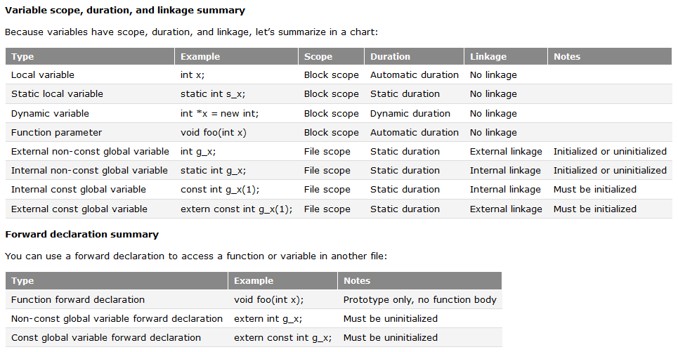

# Chapter 4

## Scope and duration of variables and linkage

### Local and global variables

**local variables**: 함수 내부에서 선언된 변수들을 **지역변수**라고 합니다.
지역변수는 메모리에 대해서 자동으로 관리되는 수명(**automatic duration**)을 가지고 있고, 이것은 변수가 정의되었을 때 생성되고, 블록(`{}`) 내부에서 벗어날 때 삭제된다는 것을 의미합니다.
지역변수는 블록(`{}`)단위의 제한범위(**block scope**)를 가지고 있습니다.

**global variables**: 함수 밖에서 선언된 변수들을 **전역변수**라고 합니다.  
전역변수는 메모리에 대해서 정적인 수명(**static duration**)을 가지고 있고, 이것은 프로그램이 시작해서 만들어지고 끝날 때 없어진다는 것을 의미합니다.  
전역변수는 파일(.cpp -> .obj)단위의 제한범위(**file scope**)를 가지고 있고, 기본적으로 전역변수가 선언된 파일에서만 사용될 수 있다는 것을 의미합니다.

_variable hiding_, _shadowing_

```cpp
#include <iostream>
int value{5}; // global variable
 
int main()
{
    int value = 7; // hides the global variable value
    value++; // increments local value, not global value
    ::value--; // decrements global value, not local value
 
    std::cout << "global value: " << ::value << "\n";
    std::cout << "local value: " << value << "\n";
    return 0;
} // local value is destroyed
```

### Internal and external linkage via the static and extern keywords.

**Scope**와 **duration** 말고도, 변수는 제 3의 특성을 설정할 수 있습니다. 그것은 바로 **linkage**입니다.  
**linkage**: 같은 변수에 대해서 여러 인스턴스(instance: 메모리를 할당받아 선언된 변수)를 설정할 수 있게 합니다.

Linkage가 없는 변수는 오직 변수가 속해있는 제한된 스코프에서만 사용할 수 있습니다.  
지역변수는 linkage가 없는 변수의 대표적인 예입니다. 스코프 밖에서 같은 이름의 변수를 새로 만들어도 다른 변수로 취급되는 이유는 linkage가 없기 때문입니다. 즉, 같은 변수에 대해서 여러 인스턴스가 생성되지 않습니다.

**internal linkage**: static variable, 스태틱 변수는 정적변수라고 (전역변수와는 다른 의미) 합니다. 정적변수는 파일 내부로 연결 특성을 가지고 있어서 정적변수가 선언된 파일(.cpp -> .obj)에서는 연결되어 사용 가능하지만 외부에서는 사용 불가능합니다.  
전역변수를 파일 내부에서(내부연결) 사용하고 싶다면 (global variable internal, able to be used only within a single file), `staic` 키워드를 사용하면 됩니다.

**external linkage**: external variable, 외부 변수는 파일 안과 밖에서 모두 연결되어 사용 가능합니다.  
전역변수를 프로그램 전체, 한 파일 밖에서(외적연결) 사용하고 싶다면 (global variable external, able to be used anywhere in our program), `extern` 키워드를 사용하면 됩니다.

다른 파일에서 선언된 함수를 사용하기 위해서 **forward declaration**을 했던 것과 마찬가지로, **external global variable**을 다른 파일에서 사용하기 위해서는 forward declaration을 해야합니다.

```cpp
// global.cpp
// define two global variables
// non-const globals have external linkage by default
int g_x; // external linkage by default
extern int g_y{2}; // external linkage by default, so this extern is redundant and ignored
 
// in this file, g_x and g_y can be used anywhere beyond this point
```

```cpp
// main.cpp
extern int g_x; // forward declaration for g_x (defined in global.cpp) -- g_x can now be used beyond this point in this file
 
int main()
{
    extern int g_y; // forward declaration for g_y (defined in global.cpp) -- g_y can be used beyond this point in main() only
 
    g_x = 5;
    std::cout << g_y; // should print 2
 
    return EXIT_SUCCESS;
}
```

만약 한 파일에서 스태틱 변수가 정의되어있고, 다른 파일에서 사용하려고 한다면 컴파일 오류가 날 것 입니다.

```cpp
// main.cpp
void incrementAndPrint() {
  static int s_value = 1;  // static duration via static keyword.  This line is
                           // only executed once.
  ++s_value;
  std::cout << s_value << '\n';
}  // s_value is not destroyed here, but becomes inaccessible

int main() {
  incrementAndPrint();
  incrementAndPrint();
  incrementAndPrint();

  return EXIT_SUCCESS;
}
```

```
results: 

2
3
4
```

### Function linkage

함수도 변수의 linkage와 동일합니다.

그런데, 프로그램 작성 규칙에는 '하나의 정의'라는 것이 있습니다. 오브젝트(변수)든지 함수든지 그것의 시그니처(타입, 이름, 그리고 함수의 경우 파라미터까지)가 같다면 동일한 것이고, 프로그램를 통틀어 한번만 '정의'되어야 한다는 것입니다. 하지만 non-extern 변수들이 서로 다른 파일에 있으면 그들의 시그니처가 같아도 다른 entity로 여겨집니다.


> non-extern version

```cpp
#ifndef CONSTANT_H_
#define CONSTANT_H_

const double g_gravity{9.8};
auto PrintGravity() -> void;

#endif  // !CONSTANT_H_
```

```cpp
// constant.cpp
#include <iostream>
#include "constant.h"

//const double g_gravity{9.8};

auto PrintGravity() -> void {
  std::cout << g_gravity << " " << &g_gravity << "in constant.cpp" << std::endl;
}```

```cpp
// main.cpp
#include <iostream>
#include "constant.h"

int main() {
  std::cout << g_gravity << " " << &g_gravity << "in main.cpp" << std::endl;
  PrintGravity();

  return EXIT_SUCCESS;
}
```

```
results:

9.8 00EC9B68 in main.cpp -> Addresses of g_gravity variables are differ.
9.8 00EC9B30 in constant.cpp
```

> extern version

```cpp
#ifndef CONSTANT_H_
#define CONSTANT_H_

extern const double g_gravity; // forward declaration
auto PrintGravity() -> void;

#endif  // !CONSTANT_H_
```

```cpp
// constant.cpp
#include <iostream>
#include "constant.h"

extern const double g_gravity{9.8}; // definition

auto PrintGravity() -> void {
  std::cout << g_gravity << " " << &g_gravity << "in constant.cpp" << std::endl;
}```

```cpp
// main.cpp
#include <iostream>
#include "constant.h"

int main() {
  std::cout << g_gravity << " " << &g_gravity << "in main.cpp" << std::endl;
  PrintGravity();

  return EXIT_SUCCESS;
}
```

```
results:

9.8 00B99B30 in main.cpp -> Addresses of g_gravity variables are same.
9.8 00B99B30 in constant.cpp
```

### Scope, duration, and linkage summary

#### Scope summary

An identifier’s **scope** determines where it is accessible. An identifier that is out of scope can not be accessed.

- Variables with **block scope** / local scope can only be accessed within the block in which they are declared (including nested blocks). This includes:
   - Local variables
   - Function parameters
   - Locally-defined types
- Variables and functions with global scope / **file scope** can be accessed anywhere in the file. This includes:
   - Global variables
   - Normal functions
   - Globally-defined types

#### Duration summary

A variable’s **duration** determines when it is created and destroyed.

- Variables with **automatic duration** are created at the point of definition, and destroyed when the block they are part of is exited. This includes:
   - Normal local variables
- Variables with **static duration** are created when the program begins and destroyed when the program ends. This includes:
   - Global variables
   - Static local variables
- Variables with **dynamic duration** are created and destroyed by programmer request. This includes:
   - Dynamically allocated variables (we’ll talk about these when we cover dynamic allocation in chapter 6)

#### Linkage summary

An identifier’s **linkage** determines whether multiple instances of an identifier refer to the same identifier or not.

- Identifiers with **no linkage** mean the identifier only refers to itself. This includes:
   - Normal local variables
   - User-defined types, such as enums, typedefs, and classes declared inside a block (we’ll cover these in later lessons).
- Identifiers with **internal linkage** can be accessed anywhere within the file it is declared. This includes:
   - Static global variables (initialized or uninitialized)
   - Const global variables
   - Static functions (we’ll cover these in chapter 7)
- Identifiers with **external linkage** can be accessed anywhere within the file it is declared, or other files (via a forward declaration). This includes:
   - Normal functions
   - Non-const global variables (initialized or uninitialized)
   - Extern const global variables
   - User-defined types, such as enums, typedefs, and classes declared in the global scope (we’ll cover these in later lessons).



## Enum

```cpp
#include <iostream>

int main()
{
    enum class Color // "enum class" defines this as a scoped enumeration instead of a standard enumeration
    {
        RED, // RED is inside the scope of Color
        BLUE
    };
 
    enum class Fruit
    {
        BANANA, // BANANA is inside the scope of Fruit
        APPLE
    };
 
    Color color = Color::RED; // note: RED is not directly accessible any more, we have to use Color::RED
    Fruit fruit = Fruit::BANANA; // note: BANANA is not directly accessible any more, we have to use Fruit::BANANA
	
    if (color == fruit) // compile error here, as the compiler doesn't know how to compare different types Color and Fruit
        std::cout << "color and fruit are equal\n";
    else
        std::cout << "color and fruit are not equal\n";
 
    return 0;
}
```

```cpp
#include <iostream>
int main()
{
    enum class Color
    {
        RED,
        BLUE
    };
 
    Color color = Color::RED;
 
    if (color == Color::RED) // this is okay
        std::cout << "The color is red!\n";
    else if (color == Color::BLUE)
        std::cout << "The color is blue!\n";
 
    return 0;
}
```

## Type aliases

```cpp
typedef double distance_t; // define distance_t as an alias for type double
using distance_t = double; // define distance_t as an alias for type double

using PairList = std::vector<std::pair<std::string, int>>
```

## Struct

```cpp
struct Employee
{
    short id;
    int age;
    double wage;
};
```

```cpp
Employee joe; // create an Employee struct for Joe
joe.id = 14; // assign a value to member id within struct joe
joe.age = 32; // assign a value to member age within struct joe
joe.wage = 24.15; // assign a value to member wage within struct joe
// Employee joe { 14, 32, 24.15 }

Employee frank; // create an Employee struct for Frank
frank.id = 15; // assign a value to member id within struct frank
frank.age = 28; // assign a value to member age within struct frank
frank.wage = 18.27; // assign a value to member wage within struct frank
// Employee frank { 15, 28, 18.27 }

int totalAge = joe.age + frank.age;
 
if (joe.wage > frank.wage)
    std::cout << "Joe makes more than Frank\n";
else if (joe.wage < frank.wage)
    std::cout << "Joe makes less than Frank\n";
else
    std::cout << "Joe and Frank make the same amount\n";
 
// Frank got a promotion
frank.wage += 2.50;
 
// Today is Joe's birthday
++joe.age; // use pre-increment to increment Joe's age by 1
```

> nested structs initialization

```cpp
struct Employee
{
    short id;
    int age;
    float wage;
};
 
struct Company
{
    Employee CEO; // Employee is a struct within the Company struct
    int numberOfEmployees;
};
 
Company myCompany = {{ 1, 42, 60000.0f }, 5 };
```

## Comprehensive quiz

### Q1

Check the following comments and overwrite "??" as an appropriate property of variables.

```cpp
// Uninitialized definition:
int g_x;        // defines uninitialized g?? variable (?? linkage)
static int g_x; // defines uninitialized s?? variable (?? linkage)
const int g_x;  // not allowed: const variables must be ??
 
// Forward declaration via extern keyword:
extern int g_z;       // forward declaration for g?? variable defined elsewhere
extern const int g_z; // forward declaration for c?? g?? variable defined elsewhere
 
// Initialized definition:
int g_y(1);        // defines initialized ?? variable (?? linkage)
static int g_y(1); // defines initialized ?? variable (?? linkage)
const int g_y(1);  // defines initialized const variable (?? linkage)
 
// Initialized definition with extern keyword:
extern int g_w(1);       // defines initialized ?? variable (?? linkage, extern keyword is redundant in this case)
extern const int g_w(1); // defines initialized const ?? variable (?? linkage)
```

### Q2

In designing a game, we decide we want to have monsters, because everyone likes fighting monsters. Declare a struct that represents your monster. The monster should have a type that can be one of the following: an ogre, a dragon, an orc, a giant spider, or a slime. If you’re using C++11, use an enum class for this.

Each individual monster should also have a name (use a std::string), as well as an amount of health that represents how much damage they can take before they die. Write a function named PrintMonster() that prints out all of the struct’s members. Instantiate an ogre and a slime, initialize them using an initializer list, and pass them to PrintMonster().

Your program should produce the following output:

```
This Ogre is named Torg and has 145 health.
This Slime is named Blurp and has 23 health.
```
