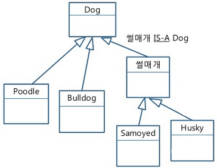

# Chapter 8

## 객체지향 프로그래밍

Procedural programming (PP) -> Object-oriented programming (OOP) -> Functional programming (FP)

c++는 객체지향 프로그래밍

객체위주 프로그래밍의 키워드 5

- 클래스 (class)
- 오브젝트 (object)
- 캡슐화 (encapsulation)
- 상속성 (inheritance)
- 다형성 (plymorphism)

**클래스 (class)** = **추상 (abstract)**

클래스는 표현 대상의 **특징에 대해 서술한다.**  
즉, 추상은 사용자가 구체적인 내용을 생각하지 않고도 사용할 수 있도록 하는 기능

**오브젝트 (object)** = **실체 (instance)**

**캡슐화 (encapsulation)**

관련 있는 것을 묶어서 이름을 부여, 바로 추상화 (abstraction)

**상속성 (inheritance)**

하나의 클래스가 가지고 있는 특징들을 그대로 다른 클래스가 물려 받는 것  
이는 "Is-A" 관계가 성립해야한다.



**다형성 (plymorphism)**

같은 이름의 명령을 다른 클래스에서 다른 내용으로 구현할 수 있다.


***객체지향은 캡슐화, 상속성, 그리고 다형성을 사용해서 사람이 세계를 보고 이해하는 방법을 흉내낸 프로그래밍 패러다임이다.***  
***구현해야 할 것들을 추상화하고 이를 분류해서 같은 방법으로 다루는 것은 코드를 모듈화 할 수 있게 만들고, 모듈화는 코드를 재사용 가능하게 만들어서 구현할 프로그램과 기능을 이해하기 쉽게 만든다.***
***그리고 모든 코드는 공개할 것만 공개하고 코드를 재사용하므로써 중복되지 않게 만들어야 하나의 기능을 수정할 때 여러 클래스(혹은 함수)를 옮겨 다니며 고치는 일이 없다. (객체 지향을 따르며 사이드 이펙트를 줄이는 방향으로 코드를 작성해야한다.)***

### 클래스

접근 제한자:

- private:
- public:
- protected:

```cpp
#include <iostream>
 
class Date // members are private by default
{
    int month_; // private by default, can only be accessed by other members
    int day_; // private by default, can only be accessed by other members
    int year_; // private by default, can only be accessed by other members
 
public:
    void SetDate(const int month, const int day, const int year); // public, can be accessed by anyone
    void Print(); // public, can be accessed by anyone
};
 
int main()
{
    Date date;
    date.SetDate(10, 14, 2020); // okay, because SetDate() is public
    date.Print(); // okay, because Print() is public
 
    return 0;
}

void Date::SetDate(int month, int day, int year) {
    // SetDate() can access the private members of the class because it is a member of the class itself
    month_ = month;
    day_ = day;
    year_ = year;
}

void Date::Print() {
    std::cout << month_ << "/" << day_ << "/" << year_;
}
```

정보 은닉화

생성자 (생성자 초기화 리스트)

소멸자 (RAII)

## Comprehensive quiz

### Q1: Write a class named Point3d.

_Requirements:_

- `Point3d` should contain three member variables of type `double`: `x_`, `y_`, and `z_` they defaulted to `0.0`.
- Provide a `constructor`, a `copy constructor`, a `destructor`, a `Print` function, and `accessor functions`.
- Add a static member function named `DistanceBetween` that takes two `Point3d` as a parameter, and calculates the distance between them. Given two points `(x0, y0, z0)` and `(x1, y1, z1)`, the distance between them can be calculated as `sqrt((x0 - x1)*(x0 - x1) + (y0 - y1)*(y0 - y1) + (z0 - z1)*(z0 - z1))`. The `sqrt` function lives in header `cmath`.

The following program should run:

```cpp
#include <iostream>
 
int main() {
    Point3d first(3.0, 4.0, 5.0);
    Point3d second(first);
    Point3d third(1.0, 2.0);

    first.Print();
    second.Print();

    std::cout << third.Z() << std::endl;
    third.SetZ(3.0);
    std::cout << third.Z() << std::endl;

    std::cout << "Distance between two points: " << Point3D::DistanceBetween(second, third) << std::endl;

    return 0;
}
```

```
results:

Point3D constructed.
Point3D copied.
Point3D constructed.
Point3D: 3.0 4.0 5.0
Point3D: 3.0 4.0 5.0
Z of Point3D: 0.0
Z of Point3D: 3.0
Distance between two points: 5
Point3D destoyed.
Point3D destoyed.
Point3D destoyed.
```

### Q2: Write a destructor for this class

```cpp
class HelloWorld
{
private:
	char *data_;
 
public:
	HelloWorld() {
		data_ = new char[14];
		const char *init = "Hello, World!";
		for (int i = 0; i < 14; ++i)
			data_[i] = init[i];
	}
 
	~HelloWorld() {
        // replace this comment with your destructor implementation
	}
 
	void Print() const {
		std::cout << data_;
	}
 
};
 
int main()
{
	HelloWorld hello;
	hello.Print();
 
    return 0;
}
```

### Q3: Let’s create a random monster generator.

_Requirements:_

- First, let’s create an enumeration of monster types named `MonsterType`. Include the following monster types: `DRAGON`, `GOBLIN`, `OGRE`, `ORC`, `SKELETON`, `TROLL`, `VAMPIRE`, and `ZOMBIE`. Add an additional `MAX_MONSTER_TYPES` so we can count how many enumerators there are.
- Second, let’s create our `Monster` class. Our Monster will have 4 attributes (member variables): a type (`MonsterType`), a name (`std::string`), a roar (`std::string`), and the number of hit points (공격력) (`int`). Create a Monster class that has these 4 member variables.
- enum `MonsterType` is specific to `Monster`, so _move the enum inside the class_ as a `public` declaration.
- Create a `constructor` that allows you to _initialize all of the member variables_.

The following program should compile:

```cpp
int main() {
	Monster skeleton(Monster::SKELETON, "Bones", "*rattle*", 4);
 
    return 0;
}
```

- We want to be able to print our monster so we can validate it’s correct. To do that, we’re going to need to write a function that converts a `MonsterType` into a `std::string`. Write that function (called `GetTypeString()`), as well as a `Print()` member function.

The following program should compile:

```cpp
int main() {
	Monster skeleton(Monster::SKELETON, "Bones", "*rattle*", 4);
    skeleton.Print();

    return 0;
}
```

```
results:

Bones the skeleton has 4 hit points and says *rattle*.
```

- We can create a random monster generator. Let’s consider how our `MonsterGenerator` class will work. Ideally, we’ll ask it to give us a `Monster`, and it will create a random one for us. We don’t need more than one `MonsterGenerator`. This is a good candidate for a `static class` (one in which all functions are `static`). Create a `static MonsterGenerator` class. Create a `static function` named `GenerateMonster()`. This should return a `Monster`.

`MonsterGenerator` needs to generate some random attributes. To do that, we’ll need to make use of this handy function:

```cpp
// Generate a random number between min and max (inclusive)
// Assumes random device, and mt19937 (named gen) has already been generated.
static int GetRandomNumber(int min, int max) {
    std::uniform_int_distribution<> dis(min, max);
    return dis(gen);
}
```

Now edit function `GenerateMonster()` to generate a random `MonsterType` (between `0` and `Monster::MAX_MONSTER_TYPES-1`) and a random hit points (between `1` and `100`). This should be fairly straightforward. Once you’ve done that, define two `static` fixed arrays of size `6` inside the function (named `names_` and `roars_`) and initialize them with `6` names and `6` sounds of your choice. Pick a random name from these arrays.

The following program should compile:

```cpp
int main() {
	Monster monster = MonsterGenerator::GenerateMonster();
	monster.Print();

    return 0;
}
```

```
results:

Bones the skeleton has 4 hit points and says *rattle*.
```

### Q4: Why did we declare variables `names_` and `roars_` as `static`?

